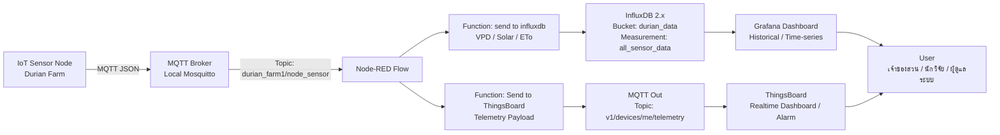

# prototype.md — Software Architecture Prototype สำหรับ Dashboard สวนทุเรียน

## 1. วัตถุประสงค์ของระบบ

เอกสารนี้กำหนดโครงสร้างสถาปัตยกรรมซอฟต์แวร์สำหรับระบบ Dashboard แสดงผลสภาพแวดล้อมภายในสวนทุเรียน โดยอ้างอิงจาก Node-RED Flow และช่วงค่า VPD จากไฟล์แนบ

ระบบรองรับการแสดงผลข้อมูลจาก MQTT, การบันทึกลง InfluxDB, การส่ง Telemetry ไปยัง ThingsBoard และการออกแบบ Dashboard ให้แสดงผลในรูปแบบ Graph, Gauge, Numeric Card, Status Card และ Icon-based Alert

---

## 2. ภาพรวมสถาปัตยกรรมระบบ



---

## 3. แหล่งข้อมูลหลักของระบบ

### 3.1 MQTT Input

| รายการ | ค่า |
|---|---|
| MQTT Broker | Local MQTT Broker |
| Host | `localhost` |
| Port | `1883` |
| Input Topic | `durian_farm1/node_sensor` |
| QoS | `2` |
| Payload | JSON หรือ Object |
| Node-RED Node | `mqtt in` |

---

## 4. โครงสร้าง Payload ที่คาดหวังจาก IoT Node

```json
{
  "time": "DD/MM/YYYY HH:MM:SS",
  "node": "node01",
  "zone": "zone01",
  "env": {
    "air_temp": 30.5,
    "air_humi": 72.0,
    "lux": 54000,
    "wind_speed_avg5m": 1.2,
    "wind_dir_deg": 135,
    "wind_dir_th": "ตะวันออกเฉียงใต้"
  },
  "npk": {
    "soil_temp": 28.4,
    "soil_humi": 65.0,
    "ec": 1.25,
    "ph": 6.4,
    "n": 45,
    "p": 18,
    "k": 120
  }
}
```

หมายเหตุ: Flow เดิมรองรับชื่อ field ทั้งแบบ `air_temp`, `soil_temp` และ `Air_temp`, `Soil_temp`

---

## 5. Data Processing Layer ใน Node-RED

### 5.1 Function: `send to influxdb`

หน้าที่หลัก

1. Parse MQTT Payload
2. แปลงเวลา `DD/MM/YYYY HH:MM:SS` เป็น timestamp แบบ millisecond
3. สร้าง Tag คงที่สำหรับ InfluxDB
4. แยกข้อมูลออกเป็นกลุ่ม `env` และ `npk`
5. คำนวณค่าที่ได้จาก Sensor ได้แก่
   - `vpd_kpa`
   - `es_kpa`
   - `ea_kpa`
   - `solar_wm2_est`
   - `solar_mj_m2_h_est`
   - `eto_mm_h_est`
   - `eto_mm_day_est`
6. ส่งข้อมูลเข้า InfluxDB แบบ Batch

### 5.2 Function: `Send to Thingsbard`

หน้าที่หลัก

1. Parse MQTT Payload
2. ดึงค่าจาก `env` และ `npk`
3. คำนวณ VPD, Solar และ ETo เพื่อใช้กับ ThingsBoard Telemetry
4. สร้าง Telemetry Payload
5. ส่งออกไปยัง ThingsBoard MQTT API ผ่าน Topic:

```text
v1/devices/me/telemetry
```

---

## 6. InfluxDB Design

### 6.1 InfluxDB Configuration

| รายการ | ค่า |
|---|---|
| InfluxDB Version | 2.x |
| URL | `http://localhost:8086` |
| Organization | `sci-iot` |
| Bucket | `durian_data` |
| Measurement | `all_sensor_data` |
| Precision | `ms` |

### 6.2 Tags

| Tag | ความหมาย | ตัวอย่าง |
|---|---|---|
| `location` | พื้นที่สวน | `farm1` |
| `node` | รหัส Node | `node01` |
| `zone` | โซนปลูก | `zone01` |
| `sensor` | ประเภทข้อมูล | `env`, `npk` |

### 6.3 Fields กลุ่ม Environment

| Field | หน่วย | ความหมาย |
|---|---:|---|
| `air_temp` | °C | อุณหภูมิอากาศ |
| `air_humi` | %RH | ความชื้นสัมพัทธ์อากาศ |
| `lux` | lux | ความเข้มแสง |
| `wind_speed_avg5m` | m/s | ความเร็วลมเฉลี่ย 5 นาที |
| `wind_dir_deg` | degree | ทิศทางลมเป็นองศา |
| `wind_dir_th` | text | ทิศทางลมภาษาไทย |
| `es_kpa` | kPa | Saturation Vapor Pressure |
| `ea_kpa` | kPa | Actual Vapor Pressure |
| `vpd_kpa` | kPa | Vapor Pressure Deficit |
| `solar_wm2_est` | W/m² | ค่าประมาณรังสีแสงอาทิตย์จาก lux |
| `solar_mj_m2_h_est` | MJ/m²/h | ค่าประมาณพลังงานแสงอาทิตย์รายชั่วโมง |
| `eto_mm_h_est` | mm/h | ค่าประมาณ ETo รายชั่วโมง |
| `eto_mm_day_est` | mm/day | ค่าประมาณ ETo รายวัน |

### 6.4 Fields กลุ่ม Soil / NPK

| Field | หน่วย | ความหมาย |
|---|---:|---|
| `soil_temp` | °C | อุณหภูมิดิน |
| `soil_humi` | % | ความชื้นดิน |
| `ec` | mS/cm หรือ dS/m | ค่าการนำไฟฟ้าของดิน |
| `ph` | pH | ค่าความเป็นกรด-ด่างของดิน |
| `n` | mg/kg หรือ ppm | ไนโตรเจน |
| `p` | mg/kg หรือ ppm | ฟอสฟอรัส |
| `k` | mg/kg หรือ ppm | โพแทสเซียม |

---

## 7. สูตรคำนวณที่ใช้ในระบบ

### 7.1 Saturation Vapor Pressure

```text
es = 0.6108 × exp((17.27 × T) / (T + 237.3))
```

### 7.2 Actual Vapor Pressure

```text
ea = es × (RH / 100)
```

### 7.3 Vapor Pressure Deficit

```text
VPD = es - ea
```

หรือ

```text
VPD = es × (1 - RH / 100)
```

หน่วย: `kPa`

### 7.4 Solar Radiation Estimate from Lux

```text
solar_wm2_est = lux / 120
```

```text
solar_mj_m2_h_est = solar_wm2_est × 3600 / 1,000,000
```

ข้อสังเกต: ค่า `120 lm/W` เป็นค่าประมาณสำหรับแสงกลางวัน ควร Calibrate เพิ่มหากใช้ควบคุมระบบน้ำแบบแม่นยำ

### 7.5 ETo Estimate

```text
Rn = (1 - albedo) × solar_mj_m2_h_est
```

```text
delta = (4098 × es) / (T + 237.3)^2
```

```text
ETo_h =
[0.408 × delta × Rn + gamma × (900 / (T + 273)) × u2 × VPD]
/
[delta + gamma × (1 + 0.34 × u2)]
```

```text
ETo_day = ETo_h × 24
```

ค่าคงที่ที่ใช้

| ค่า | ความหมาย |
|---|---|
| `albedo = 0.23` | สัดส่วนการสะท้อนแสงของพื้นผิวพืช |
| `gamma = 0.0665` | Psychrometric constant โดยประมาณ |
| `u2` | ความเร็วลม ใช้ `wind_speed_avg5m` |

---

## 8. VPD Status Logic สำหรับทุเรียน

| ช่วง VPD | สถานะ | ความหมาย | Action ที่ระบบควรแนะนำ | สี/สัญลักษณ์ |
|---:|---|---|---|---|
| `< 0.40` | ต่ำเกินไป | อากาศชื้นจัด พืชคายน้ำน้อย เสี่ยงโรครา | งดให้น้ำและงดพ่นหมอก เพิ่มการระบายอากาศ | 🔵 Too Low |
| `0.40 - 0.80` | เฝ้าระวังต่ำ | อากาศค่อนข้างชื้น พืชคายน้ำเล็กน้อย | ระบบทำงานปกติ ไม่ต้องเพิ่มพ่นหมอก | 🟢 Low Stress |
| `0.81 - 1.40` | เหมาะสมที่สุด | ช่วงเหมาะสมของทุเรียน ปากใบเปิดดี สังเคราะห์แสงและดูดธาตุอาหารได้ดี | รักษาระดับนี้ไว้ | ✅ Optimal |
| `1.41 - 1.80` | เริ่มวิกฤต | อากาศแห้งและร้อน พืชเริ่มปิดปากใบ | แจ้งเตือนสีเหลือง ควรเปิด Fogging | 🟡 High Stress |
| `> 1.80` | วิกฤตรุนแรง | อากาศแห้งจัด เสี่ยงใบไหม้ ผลร่วง และหยุดสังเคราะห์แสง | แจ้งเตือนสีแดง เปิด Fogging เต็มกำลัง และเพิ่มรอบให้น้ำโคนต้น | 🔴 Danger |

### 8.1 Pseudo-code สำหรับ VPD Alert

```javascript
function getVpdStatus(vpd) {
  if (vpd < 0.40) {
    return {
      level: "too_low",
      text: "VPD ต่ำเกินไป: อากาศชื้นจัด เสี่ยงโรครา",
      action: "งดให้น้ำ/งดพ่นหมอก และเพิ่มการระบายอากาศ",
      icon: "🔵"
    };
  }

  if (vpd <= 0.80) {
    return {
      level: "low_stress",
      text: "VPD ค่อนข้างต่ำ: เฝ้าระวังความชื้นสูง",
      action: "ระบบทำงานปกติ ไม่ต้องเปิดพ่นหมอกเพิ่ม",
      icon: "🟢"
    };
  }

  if (vpd <= 1.40) {
    return {
      level: "optimal",
      text: "VPD เหมาะสมที่สุดสำหรับทุเรียน",
      action: "รักษาระดับนี้ไว้",
      icon: "✅"
    };
  }

  if (vpd <= 1.80) {
    return {
      level: "high_stress",
      text: "VPD เริ่มวิกฤต: อากาศแห้งและร้อน",
      action: "ควรเปิดระบบพ่นหมอกเพื่อเพิ่มความชื้น",
      icon: "🟡"
    };
  }

  return {
    level: "danger",
    text: "VPD วิกฤตรุนแรง: เสี่ยงใบไหม้และผลร่วง",
    action: "เปิดระบบพ่นหมอกเต็มกำลัง และเพิ่มรอบให้น้ำโคนต้น",
    icon: "🔴"
  };
}
```

---

## 9. Soil pH Status Logic

Dashboard ต้องแสดงค่า pH พร้อมข้อความและสัญลักษณ์แสดงความเป็นกรด-ด่างของดิน

| ค่า pH | สถานะ | ความหมาย | สี/สัญลักษณ์ |
|---:|---|---|---|
| `< 5.0` | กรดรุนแรง | ดินเป็นกรดมาก อาจกระทบการดูดธาตุอาหาร | 🔴 Acidic |
| `5.0 - 5.5` | กรด | ควรเฝ้าระวังและพิจารณาปรับปรุงดิน | 🟠 Acid |
| `5.6 - 6.5` | เหมาะสม | เหมาะกับไม้ผลเขตร้อนรวมถึงทุเรียนโดยทั่วไป | ✅ Suitable |
| `6.6 - 7.5` | ใกล้กลาง | ยังใช้งานได้ แต่ควรติดตามร่วมกับ EC และธาตุอาหาร | 🟡 Near Neutral |
| `> 7.5` | ด่าง | ดินเป็นด่าง อาจมีผลต่อการละลายธาตุอาหารบางชนิด | 🔵 Alkaline |

### 9.1 Pseudo-code สำหรับ pH Alert

```javascript
function getPhStatus(ph) {
  if (ph < 5.0) {
    return { level: "strong_acid", text: "ดินเป็นกรดรุนแรง", action: "ตรวจสอบซ้ำและพิจารณาปรับปรุงดิน", icon: "🔴" };
  }
  if (ph <= 5.5) {
    return { level: "acid", text: "ดินเป็นกรด", action: "เฝ้าระวังและตรวจร่วมกับ EC/NPK", icon: "🟠" };
  }
  if (ph <= 6.5) {
    return { level: "suitable", text: "pH อยู่ในช่วงเหมาะสม", action: "รักษาสภาพดินและติดตามต่อเนื่อง", icon: "✅" };
  }
  if (ph <= 7.5) {
    return { level: "near_neutral", text: "ดินใกล้กลาง", action: "ติดตามร่วมกับ EC และธาตุอาหาร", icon: "🟡" };
  }
  return { level: "alkaline", text: "ดินเป็นด่าง", action: "ตรวจสอบสภาพดินและความพร้อมใช้ของธาตุอาหาร", icon: "🔵" };
}
```

---

## 10. Dashboard Prototype Design

Dashboard ควรแบ่งออกเป็น 5 ส่วนหลัก

### 10.1 Overview Panel

| Widget | Field | รูปแบบ | Icon |
|---|---|---|---|
| อุณหภูมิอากาศ | `air_temp` | Gauge + Number | 🌡️ |
| ความชื้นอากาศ | `air_humi` | Gauge + Number | 💧 |
| VPD | `vpd_kpa` | Gauge + Status Card | 🍃 |
| ความเข้มแสง | `lux` | Number + Sparkline | ☀️ |
| ความเร็วลม | `wind_speed_avg5m` | Gauge | 🌬️ |
| ทิศทางลม | `wind_dir_deg`, `wind_dir_th` | Compass / Text | 🧭 |
| ความชื้นดิน | `soil_humi` | Gauge | 🌱 |
| pH ดิน | `ph` | Gauge + Status Card | 🧪 |

### 10.2 Environment Graph Panel

| Graph | Fields |
|---|---|
| Air Temperature Trend | `air_temp` |
| Air Humidity Trend | `air_humi` |
| VPD Trend | `vpd_kpa` |
| Lux / Solar Radiation Trend | `lux`, `solar_wm2_est` |
| Wind Speed Trend | `wind_speed_avg5m` |
| ETo Estimate Trend | `eto_mm_day_est` |

### 10.3 Soil / NPK Panel

| Widget | Field | รูปแบบ |
|---|---|---|
| Soil Temperature | `soil_temp` | Gauge |
| Soil Moisture | `soil_humi` | Gauge |
| Soil EC | `ec` | Number + Trend |
| Soil pH | `ph` | Gauge + Acid/Alkaline Status |
| Nitrogen | `n` | Number |
| Phosphorus | `p` | Number |
| Potassium | `k` | Number |

### 10.4 VPD Decision Support Panel

| รายการ | รายละเอียด |
|---|---|
| Current VPD | ค่า `vpd_kpa` ล่าสุด |
| Status | Too Low / Low Stress / Optimal / High Stress / Danger |
| Meaning | อธิบายผลกระทบต่อทุเรียน |
| Recommended Action | คำแนะนำให้ระบบหรือผู้ดูแลสวน |
| Alert Symbol | สีและ Icon ตามระดับความเสี่ยง |

ตัวอย่างข้อความบน Dashboard

```text
✅ VPD 1.12 kPa — เหมาะสมที่สุด
ทุเรียนอยู่ในช่วงเปิดปากใบดี เหมาะต่อการสังเคราะห์แสงและดูดธาตุอาหาร
คำแนะนำ: รักษาระดับนี้ไว้
```

```text
🔴 VPD 1.95 kPa — วิกฤตรุนแรง
อากาศแห้งจัด เสี่ยงใบไหม้และผลร่วง
คำแนะนำ: เปิดระบบพ่นหมอกเต็มกำลัง และเพิ่มรอบให้น้ำโคนต้น
```

### 10.5 pH Decision Support Panel

```text
✅ pH 6.2 — ดินอยู่ในช่วงเหมาะสม
เหมาะต่อการดูดซึมธาตุอาหารของไม้ผล
คำแนะนำ: รักษาสภาพดินและติดตามต่อเนื่อง
```

```text
🔴 pH 4.8 — ดินเป็นกรดรุนแรง
อาจกระทบการดูดธาตุอาหารและสุขภาพราก
คำแนะนำ: ตรวจสอบซ้ำด้วยเครื่องมือมาตรฐาน และพิจารณาปรับปรุงดิน
```

---

## 11. ThingsBoard Telemetry Keys

```json
{
  "air_temp": 30.5,
  "air_humi": 72.0,
  "wind_speed_avg5m": 1.2,
  "wind_dir_deg": 135,
  "lux": 54000,
  "soil_temp": 28.4,
  "soil_humi": 65.0,
  "ec": 1.25,
  "ph": 6.4,
  "n": 45,
  "p": 18,
  "k": 120,
  "vpd_kpa": 1.23,
  "solar_wm2_est": 450.0,
  "solar_mj_m2_h_est": 1.62,
  "eto_mm_day_est": 4.85
}
```

### 11.1 ThingsBoard Widget Mapping

| Widget Type | Key |
|---|---|
| Latest Value Card | `air_temp`, `air_humi`, `vpd_kpa`, `ph` |
| Gauge | `vpd_kpa`, `air_temp`, `air_humi`, `soil_humi`, `ph` |
| Timeseries Line Chart | `air_temp`, `air_humi`, `vpd_kpa`, `eto_mm_day_est` |
| Alarm Card | `vpd_kpa`, `ph` |
| Markdown / HTML Card | VPD recommendation, pH recommendation |
| Compass Widget | `wind_dir_deg` |
| Status Icon Card | VPD status, pH status |

---

## 12. Grafana Dashboard Query Concept

### 12.1 VPD Trend

```flux
from(bucket: "durian_data")
  |> range(start: -24h)
  |> filter(fn: (r) => r._measurement == "all_sensor_data")
  |> filter(fn: (r) => r.sensor == "env")
  |> filter(fn: (r) => r._field == "vpd_kpa")
```

### 12.2 Air Temperature / Humidity

```flux
from(bucket: "durian_data")
  |> range(start: -24h)
  |> filter(fn: (r) => r._measurement == "all_sensor_data")
  |> filter(fn: (r) => r.sensor == "env")
  |> filter(fn: (r) => r._field == "air_temp" or r._field == "air_humi")
```

### 12.3 Soil pH

```flux
from(bucket: "durian_data")
  |> range(start: -7d)
  |> filter(fn: (r) => r._measurement == "all_sensor_data")
  |> filter(fn: (r) => r.sensor == "npk")
  |> filter(fn: (r) => r._field == "ph")
```

### 12.4 NPK

```flux
from(bucket: "durian_data")
  |> range(start: -7d)
  |> filter(fn: (r) => r._measurement == "all_sensor_data")
  |> filter(fn: (r) => r.sensor == "npk")
  |> filter(fn: (r) => r._field == "n" or r._field == "p" or r._field == "k")
```

---

## 13. Alert Rule Design

### 13.1 VPD Alert Rules

| Rule | Condition | Severity | Message |
|---|---|---|---|
| VPD Too Low | `vpd_kpa < 0.40` | Info / Warning | อากาศชื้นจัด เสี่ยงโรครา |
| VPD Optimal | `0.81 <= vpd_kpa <= 1.40` | Normal | สภาวะเหมาะสม |
| VPD High Stress | `1.41 <= vpd_kpa <= 1.80` | Warning | อากาศแห้ง ควรเปิด Fogging |
| VPD Danger | `vpd_kpa > 1.80` | Critical | วิกฤต ควรเปิด Fogging เต็มกำลังและเพิ่มรอบให้น้ำ |

### 13.2 pH Alert Rules

| Rule | Condition | Severity | Message |
|---|---|---|---|
| Strong Acid | `ph < 5.0` | Critical | ดินเป็นกรดรุนแรง |
| Acid | `5.0 <= ph <= 5.5` | Warning | ดินเป็นกรด |
| Suitable | `5.6 <= ph <= 6.5` | Normal | pH เหมาะสม |
| Near Neutral | `6.6 <= ph <= 7.5` | Info | ดินใกล้กลาง |
| Alkaline | `ph > 7.5` | Warning | ดินเป็นด่าง |

---

## 14. Recommended Software Stack

| Layer | Software | หน้าที่ |
|---|---|---|
| IoT Device | ESP32 / Sensor Node | อ่านค่าจาก Sensor และ Publish MQTT |
| Message Broker | Mosquitto MQTT | รับส่งข้อมูลจาก IoT Node |
| Processing | Node-RED | Parse, Transform, Calculate, Route Data |
| Time-series DB | InfluxDB 2.x | เก็บข้อมูลย้อนหลัง |
| Historical Dashboard | Grafana | วิเคราะห์แนวโน้มระยะยาว |
| Realtime IoT Platform | ThingsBoard | Realtime Dashboard, Telemetry, Alarm |
| Reverse Proxy | Nginx / Caddy | เปิดบริการผ่าน Domain และ HTTPS |
| Deployment | Docker Compose | ติดตั้งและบริหาร Service ทั้งระบบ |

---

## 15. Folder Structure ที่แนะนำ

```text
durian-dashboard/
├── docker-compose.yml
├── .env
├── node-red/
│   ├── flows.json
│   └── settings.js
├── influxdb/
│   └── data/
├── grafana/
│   ├── provisioning/
│   └── dashboards/
├── thingsboard/
│   └── data/
├── docs/
│   └── prototype.md
└── backup/
    ├── node-red-flow/
    ├── grafana-dashboard/
    └── thingsboard-dashboard/
```

---

## 16. API / Data Contract

### 16.1 MQTT Contract

| รายการ | ค่า |
|---|---|
| Direction | IoT Node → MQTT Broker |
| Topic | `durian_farm1/node_sensor` |
| Format | JSON |
| Frequency | แนะนำทุก 1–5 นาที หรือปรับตามพลังงานของ Node |
| QoS | 1 หรือ 2 |

### 16.2 ThingsBoard Contract

| รายการ | ค่า |
|---|---|
| Direction | Node-RED → ThingsBoard |
| Topic | `v1/devices/me/telemetry` |
| Format | JSON Telemetry |
| Transport | MQTT |
| Broker Port | `1884` ตาม Flow เดิม |

---

## 17. ข้อเสนอแนะเพิ่มเติมสำหรับ Prototype

### 17.1 ควรเพิ่ม Status Fields เข้า ThingsBoard โดยตรง

เพื่อให้ Dashboard ทำงานง่ายขึ้น ควรเพิ่ม field ต่อไปนี้ใน Function `Send to Thingsbard`

```json
{
  "vpd_status": "optimal",
  "vpd_message": "VPD เหมาะสมที่สุดสำหรับทุเรียน",
  "vpd_action": "รักษาระดับนี้ไว้",
  "ph_status": "suitable",
  "ph_message": "pH อยู่ในช่วงเหมาะสม",
  "ph_action": "รักษาสภาพดินและติดตามต่อเนื่อง"
}
```

### 17.2 ควรเพิ่ม Derived Status ใน InfluxDB

| Field | ความหมาย |
|---|---|
| `vpd_status_code` | 0=Too Low, 1=Low, 2=Optimal, 3=High, 4=Danger |
| `ph_status_code` | 0=Strong Acid, 1=Acid, 2=Suitable, 3=Near Neutral, 4=Alkaline |

### 17.3 ควรแยก Dashboard ตามผู้ใช้งาน

| User Role | Dashboard View |
|---|---|
| เจ้าของสวน | ภาพรวม, สถานะเตือน, คำแนะนำ |
| นักวิจัย | Time-series, Export, Raw Data |
| ผู้ดูแลระบบ | Node Status, MQTT Status, Data Pipeline Health |

---

## 18. Minimum Viable Dashboard: MVP

สำหรับ Prototype รุ่นแรก ควรสร้าง Dashboard อย่างน้อย 1 หน้า ประกอบด้วย

1. ค่าอุณหภูมิอากาศ `air_temp`
2. ความชื้นอากาศ `air_humi`
3. ค่า VPD `vpd_kpa` พร้อมสถานะและคำแนะนำ
4. ค่า pH `ph` พร้อมสถานะกรด-ด่าง
5. ความชื้นดิน `soil_humi`
6. ค่า EC `ec`
7. กราฟ VPD ย้อนหลัง 24 ชั่วโมง
8. กราฟ pH ย้อนหลัง 7 วัน
9. กราฟอุณหภูมิ/ความชื้นย้อนหลัง 24 ชั่วโมง
10. Alarm Card สำหรับ `VPD Danger` และ `pH Strong Acid`

---

## 19. สรุปแนวทางการพัฒนา

สถาปัตยกรรมที่เหมาะสมสำหรับระบบนี้คือ

```text
ESP32 Sensor Node
→ MQTT Broker
→ Node-RED Processing Layer
→ InfluxDB สำหรับข้อมูลย้อนหลัง
→ Grafana สำหรับวิเคราะห์แนวโน้ม
→ ThingsBoard สำหรับ Realtime Dashboard และ Alarm
```

หัวใจของระบบอยู่ที่ Node-RED Function Layer เพราะเป็นจุดที่รวมการแปลงข้อมูล, การคำนวณ VPD, Solar, ETo และการจัดรูปแบบข้อมูลสำหรับทั้ง InfluxDB และ ThingsBoard

สำหรับ Dashboard สวนทุเรียน ควรให้ความสำคัญกับ 2 ค่าเป็นพิเศษ

1. `vpd_kpa` — ใช้ประเมินความเครียดจากสภาพอากาศและการคายน้ำของทุเรียน
2. `ph` — ใช้ประเมินความเป็นกรด-ด่างของดินและความเหมาะสมต่อการดูดธาตุอาหาร

ระบบ Prototype นี้สามารถพัฒนาต่อยอดเป็นระบบควบคุมอัตโนมัติ เช่น เปิด Fogging, เพิ่มรอบให้น้ำ, แจ้งเตือน LINE/Telegram หรือสั่งงาน Pump Controller ได้ในระยะถัดไป

